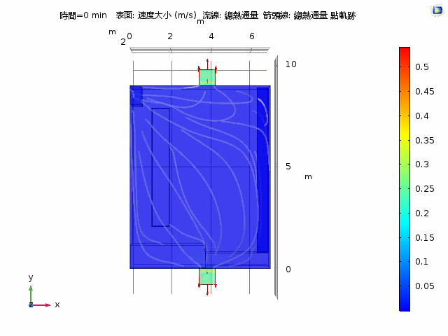

# 2017 Fall 數學軟體實作課－期末專題

## 簡介

使用 COMSOL 物理建模軟體來模擬系微內，冷氣開放時的氣體流動狀況、溫度在空間中的變化趨勢。本報告共製作三案例，輔以數張動畫來闡述模擬的結果。

## 原理

- 熱學：可將冷氣比擬成一個巨大的熱庫（thermal reservoir），能夠不停的將自己的能量傳送給別人，而自己的能量幾乎不減損。
- 流體力學：系微是一個複雜的立體空間，流體遇到牆壁、桌子後並不會規則地流動。所以必須使用紊流的模型來模擬空氣的流動狀況。

## 案例

- 開一台冷氣下的室內溫度圖，垂直剖面溫度圖，氣流流向圖，9 個位置的溫度變化圖
- 開兩台冷氣下的室內溫度圖，垂直剖面溫度圖，氣流流向圖，9 個位置的溫度變化圖
- 開三台冷氣下的室內溫度圖，垂直剖面溫度圖，氣流流向圖，9 個位置的溫度變化圖

## 實作

1. 使用皮尺，量測系微的實際長寬高。
2. 建出系微內部 3D 立體圖（設定 9 個探針，來量測特定點的溫度）。
3. 新增「流體熱傳」與「紊流」兩個物理量。
4. 設定流體熱傳：室內初始溫度 30 度 C、冷氣溫度 17 度 C，並假設門開著。
5. 設定紊流：冷氣流入速度 0.25 m/s
6. 設定網格：任意四面體、元素尺寸校正於流體動力、較粗化（節省運算時間）
7. 設定模擬時間，並讓時間相依求解器自己取決每次切的時間。
8. 實際模擬案例中的兩種狀況。分別畫出室內溫度變化圖，垂直剖面溫度變化圖，氣流流向變化圖與 9 個位置溫度變化圖。

## 結果

### 一台冷氣

#### 各點降溫曲線圖

#### 溫度流向變化圖

#### 溫度變化剖面圖

#### 溫度變化 3D 圖

### 兩台冷氣

#### 各點降溫曲線圖

#### 溫度流向變化圖

#### 溫度變化剖面圖

#### 溫度變化 3D 圖

### 三台冷氣

#### 各點降溫曲線圖

#### 溫度流向變化圖

#### 溫度變化 3D 圖

## 參考資料

1. [Heat transfer coefficient](https://en.wikipedia.org/wiki/Heat_transfer_coefficient)
2. [60 多个传热仿真模拟教程 - COMSOL 中国](https://cn.comsol.com/models/heat-transfer-module)
3. [Using Global Equations: Modeling Room Air Temperature in a House](https://www.comsol.com/blogs/using-global-equations-modeling-room-air-temperature-in-a-house/)
4. [针对 CFD 应用选择合适的湍流模型](http://cn.comsol.com/blogs/which-turbulence-model-should-choose-cfd-application/)